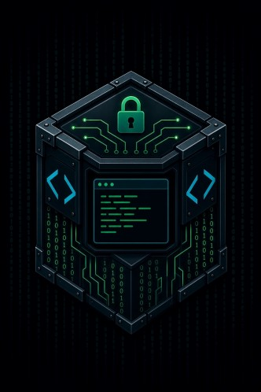

# smith-jail

An AI code agent runner that manages and executes agents inside a dynamically generated docker container scoped to a single project directory. The host
filesystem, credentials, and other projects are not visible to the agent.   A network jail is also implemented to limit access to designated
hosts only.

AI Agent support:
* [Claude Code](https://claude.ai/code),
* [Gemini CLI](https://github.com/google/gemini-cli), 
* [Codex CLI](https://github.com/openai/codex)
* [Hermes Agent](https://hermes-agent.nousresearch.com/) using remote agent
* [Hermes Agent](https://hermes-agent.nousresearch.com/) plus manged local Ollama model


---

## Background

Agentic coding tools like [Claude Code](https://claude.ai/code) and [Gemini CLI](https://github.com/google/gemini-cli)
read and write files, run shell commands, and manage git. They ship with permission
systems that prompt before each action — which works, but produces enough
interruptions that many users end up clicking through without reading.

smith-jail takes a different approach. Rather than relying on runtime approvals,
it uses Docker to establish hard boundaries before the agent starts. Only one
directory is mounted into the container. The agent cannot see — let alone touch —
anything else on the host, regardless of what it attempts.  [Debian Trixie Slim](https://hub.docker.com/layers/library/debian/trixie-slim/)
is used as the docker base.

The network jail constrains the container's outbound
traffic is transparently routed through a per-session proxy sidecar that only
relays connections to the necessary AI APIs, by hostname and by IP — every
other destination, and every other process in the container (not just the
agent), is refused.  An included viewer lets you monitor the traffic.

The goal is a **reasonable, but not foolproof, sandbox**: a hard-ish boundary
that keeps a misbehaving prompt, a jailbroken agent, or a malicious dependency
it pulls in from casually reaching outside the one directory you handed it.
It is not a hardened multi-tenant sandbox and does not defend against a
determined attacker who already has Docker access to your machine — see
[Security model](#security-model) for what is and isn't covered.

---

## Features

- **Filesystem jail** — only the target project directory is mounted into
  the container; the rest of the host filesystem, other projects, and host
  credentials (SSH keys, cloud config, browser profiles) stay invisible.
- **Network jail, on by default on Linux** (opt out with `--no-network-jail`)
  — a per-session proxy sidecar transparently relays only allowed outbound
  connections (by hostname or IP), restricting the container to the agent's
  own API plus any hosts you add — with no standing capability grant on the
  smith-jail binary itself.
- **Multi-agent support** —  each with its own image tag and
  credential directory so personas never collide.
- **Per-project configuration** — base image, extra apt packages, resource
  limits, root/sudo, network jail, and more resolve through global →
  private-per-project → environment-variable layers, with a
  content-addressed image tag per distinct effective configuration.
- **Interactive TUI dashboard** — run, shell, switch agent/project, edit
  settings, pick/pull an Ollama model, browse Docker artifacts, check for
  agent updates, and run `doctor`, all without memorizing flags.
- **`doctor` checks** — verifies Docker, SELinux status, config/build
  directory writability, disk space, and credential-directory ownership
  before you hit a wall mid-session.
- **`setup` command** — runs an agent's own login flow inside the container,
  so credentials never have to be typed into a host-installed copy of the
  tool.
- **`dockerfile` command** — prints the generated Dockerfile for a project's
  effective configuration, from the CLI or the TUI, without building it or
  needing Docker running — useful for auditing what actually goes into the
  image.
- **Resource limits** — memory/CPU caps (8 GB / 2 CPU by default) on every
  container, configurable globally or per project.
- **Docker artifact management** — list and remove smith-jail's own images,
  containers, volumes, and networks (`show`, `clean`, or the TUI's "Docker
  artifacts" screen).

---

## How it works

smith-jail is a single statically-linked binary with no runtime dependencies.
It uses the Docker SDK directly rather than shelling out to `docker compose`.

On `smith-jail [agent] run`:

1. Reads config from `$XDG_CONFIG_HOME/smith-jail/smith-jail.env`
2. Generates a Dockerfile and builds the image if not already current
3. If the network jail is active (on by default on Linux; `--no-network-jail`
   disables it for this run): creates a dedicated Docker network, starts a
   proxy sidecar on it (building the sidecar's own image from source
   smith-jail embeds, the first time it's needed), and runs a one-shot
   helper — granted `NET_ADMIN` only for this single call — that installs
   nft rules *inside the sidecar's network namespace* redirecting outbound
   :80/:443/:53 traffic into it
4. Launches the agent container, joined to the sidecar's namespace when the
   jail is active
5. On exit: removes the proxy sidecar and the session's Docker network
   (deferred cleanup)

Each project gets a container named by the SHA-256 hash of its absolute path,
so two projects with the same directory name never collide.

```
smith-jail claude run /your/project
  │
  ├─ build image if needed (debian:bookworm-slim + tools + agent)
  ├─ [optional] create session Docker network
  ├─ [optional] start proxy sidecar on it, wait for it to be listening
  ├─ [optional] run netsetup helper (NET_ADMIN, one call, then exits) to
  │             install nft redirect rules inside the sidecar's namespace
  │
  └─ docker run --rm
         ├─ bind mount: /your/project → /workspace              (rw)
         ├─ volume:     project-home  → /home/agent             (rw)
         ├─ bind mount: agent creds   → /home/agent/.claude etc (rw)
         ├─ Resource limits (8 GB RAM / 2 CPU default)
         └─ network: bridge, or the proxy sidecar's namespace
```

---

## Requirements

- Linux (fully supported) or macOS (best-effort — see [Platform support](#platform-support))
- Docker Engine on Linux; Docker Desktop on macOS
- Go 1.24+ (to build from source)

---

## Platform support

smith-jail is developed and tested on Linux, which is the fully supported
platform. Linux release binaries (amd64/arm64) are built and tested as part
of every release.

macOS builds (amd64/arm64) are published as **best effort**: they compile
and the core filesystem jail works, but they don't get the same testing as
Linux, and one feature is unavailable outright:

- **The network jail does not work on macOS**, so it defaults to *off*
  there (it defaults to *on* on Linux). It's implemented with Linux network
  namespaces and nftables, run inside the proxy sidecar and netsetup helper
  containers. On macOS, Docker Desktop runs containers inside a Linux VM
  that smith-jail doesn't control the namespacing of the same way.
  Explicitly forcing it on with `--network-jail` (or enabling it in
  settings) on macOS fails fast with an explanation rather than silently
  doing nothing; `doctor` reports the related check as not applicable.
- SELinux labelling is a no-op on macOS (there's no SELinux to label for),
  which is harmless — it only affects bind-mount labels on SELinux hosts.

Everything else — the filesystem jail, per-project config, the TUI,
`doctor`, `dockerfile`, resource limits, and Docker artifact management —
is expected to work the same way on macOS, since it's plain Docker SDK
calls with no other Linux-specific dependencies. It just hasn't seen the
mileage the Linux build has.

Windows is not supported.

---

## Building

```bash
git clone https://github.com/jrivard/smith-jail
cd smith-jail
go mod tidy
go build -o smith-jail .
```

Install to your PATH:

```bash
install -Dm755 smith-jail ~/.local/bin/smith-jail
```

---

## Quick start

```bash
# Open the interactive dashboard (also what a bare `smith-jail` does in a terminal)
smith-jail tui

# Launch Claude Code in a project directory
smith-jail claude run ~/projects/myapp

# Launch Gemini CLI in a project directory
smith-jail gemini run ~/projects/myapp

# Launch Codex CLI in a project directory
smith-jail codex run ~/projects/myapp

# Launch Hermes Agent against the cloud
smith-jail hermes run ~/projects/myapp

# Launch Hermes Agent against a local Ollama model (see "Local models" below)
smith-jail hermes-local run ~/projects/myapp
```

---

## Interactive TUI

Running `smith-jail` with no arguments (or `smith-jail tui` explicitly) opens
a full-screen dashboard instead of requiring the command-line form above.
It's the same underlying operations — nothing happens while the dashboard is
on screen; it hands off to the ordinary CLI code path once you've made a
selection and the alternate screen has been torn down, so a jailed session
still gets the real TTY.

The dashboard opens on a **sessions overview** — every currently running
agent session (refreshed every few seconds), an entry into a **New session**
submenu, and a handful of agent/project-independent utilities:

| Row | Does |
|---|---|
| *(an active session)* | Open a live [`netview`](#network-jail) of that session's network activity |
| New session ▸ | Enter the submenu below to configure/launch a session |
| Docker artifacts | Browse/remove smith-jail's images, containers, volumes, and networks |
| Check updates | Compare each agent's baked-in version against the latest available |
| Doctor | Run the same environment checks as `smith-jail doctor` |
| Help | Show the CLI help text |
| Quit | Exit |

`esc`/`q` on the sessions overview quits, same as the CLI. Selecting **New
session** opens a second always-focused menu, scoped to whichever
agent/project is currently selected; `esc`/`q` there steps back to the
sessions overview instead:

| Row | Does |
|---|---|
| Run | Launch the current agent in the current project |
| Shell | Open a shell in the current project's container |
| Change agent | Switch between Claude, Gemini, Hermes, Hermes (local) |
| Change project | Pick a directory, including recently-used projects |
| Settings | Edit `smith-jail.env` settings (Global/Project scope via `tab`) |
| Ollama model | Pick or pull the model `hermes-local` points at (see [Local models](#local-models-hermes-local)) |
| Dockerfile | Preview the generated Dockerfile for the current agent/project without building it |

Recently-used projects are tracked in `$XDG_CACHE_HOME/smith-jail/recent.json`,
backed by the `smithjail.project` Docker label on every container/volume
smith-jail creates — so the list survives even if the cache file is lost.

---

## Commands

```
smith-jail claude       <command> [flags] [args]
smith-jail gemini       <command> [flags] [args]
smith-jail hermes       <command> [flags] [args]
smith-jail hermes-local <command> [flags] [args]
smith-jail ollama       <up|down|status|pull [model]>
smith-jail show
smith-jail doctor
smith-jail tui
smith-jail help

Commands (per agent):
  run        [flags] <dir>          Launch the agent in the given directory
  shell      [flags] <dir>          Open a shell in the container
  setup      [flags] [dir] [args]   Run the agent's own setup/login inside the container (default dir: cwd)
  dockerfile [dir]                  Print the generated Dockerfile for dir's configuration (default: cwd)
  rebuild    [--yes] [dir]          Rebuild the image for dir's configuration (default: cwd)
  clean      [dir]                  Remove containers/volumes for a project, or all images/containers for this agent
```

### run

Launches the agent in the given directory. The directory is mounted at
`/workspace` inside the container. All other host paths are invisible.

```bash
smith-jail claude run ~/projects/myapp                                     # network jail on by default (Linux)
smith-jail gemini run --allow "github.com" ~/projects/myapp                # plus an extra allowed host
smith-jail claude run --no-network-jail ~/projects/myapp                   # unrestricted network for this run
```

### shell

Opens a bash shell in the container for the given directory. If an agent
session is already running for that project, execs into the running container.

```bash
smith-jail claude shell ~/projects/myapp
```

### setup

Runs the agent's own setup/login flow inside the container, so credentials
never have to be typed into a tool installed on the host. Useful for
first-time auth (e.g. a device-code/portal login flow).

```bash
smith-jail hermes setup . --portal
```

### netlog / netview

Show a project's network jail activity — every DNS query and TCP connection
the proxy sidecar saw, allowed or blocked — read from a persisted log that
survives past the session itself. Since `run`/`shell` occupy smith-jail's
own terminal for the whole session, run these in a second terminal or tmux
pane to watch live. See [Network jail](#network-jail) for details.

```bash
smith-jail claude netview .                 # live TUI
smith-jail claude netlog --follow .         # plain, pipeable tail
```

### dockerfile

Prints the Dockerfile that would be built for the given directory's effective
configuration — base image, packages, root/sudo, credential mount — without
building it. Useful for auditing exactly what goes into the image before
trusting it. Doesn't require the Docker daemon to be running. Also available
from the TUI dashboard as "Dockerfile".

```bash
smith-jail claude dockerfile ~/projects/myapp
```

### doctor

Checks the host environment for everything smith-jail depends on: Docker
(binary, daemon, permissions), whether `--network-jail` is usable on this
platform, SELinux status, config/build directory writability, free disk
space, and credential directory ownership. Prints a report and exits
non-zero if anything failed. Also available from the TUI dashboard as
"Doctor".

```bash
smith-jail doctor
```

---

## Local models (hermes-local)

`hermes-local` runs the same Hermes Agent binary as `hermes`, but talking to
a local [Ollama](https://ollama.com) model instead of the cloud. It's a
separate agent identity — its own image tag, its own credential directory
(`~/.hermes-local`, independent of `~/.hermes`) — so switching between a
cloud persona and a local one is never a matter of fighting over which
model is "default" in `config.yaml`.

The Ollama model server itself is **not** built or torn down per project the
way agent images are. It's one long-lived sidecar container
(`smithjail-ollama`) shared across every `hermes-local` session:

- `run`/`shell` offer to start it if it isn't already running (skip the
  prompt with `--yes`/`-y`), and offer to stop it on exit — default **No**,
  since the point of a sidecar is staying warm across sessions so models
  aren't reloaded from disk every time.
- Manage it directly, independent of any session, with
  `smith-jail ollama up|down|status|pull [model]`.
- It sits on its own persistent Docker network (`smithjail-ollama-net`) so
  `hermes-local` can reach it at a stable address
  (`http://smithjail-ollama:11434/v1`) regardless of whether `--network-jail`
  is in play — Docker's default `bridge` network has no name resolution, and
  `--network-jail` creates a fresh, differently-addressed network every
  session, so neither gives a stable target on its own.

Configure it in `$XDG_CONFIG_HOME/smith-jail/ollama.env`. **Defaults are
CPU-only** — no image override, no device passthrough — so a fresh
`hermes-local run` works with zero setup on any machine. GPU passthrough is
opt-in:

```bash
# AMD ROCm, e.g. RDNA3 integrated GPUs like the Radeon 780M (gfx1103) —
# HSA_OVERRIDE_GFX_VERSION presents it as the officially-supported gfx1102.
OLLAMA_IMAGE=ollama/ollama:rocm
OLLAMA_DEVICES="/dev/kfd /dev/dri"
OLLAMA_GROUP_ADD="video render"
OLLAMA_EXTRA_ENV="HSA_OVERRIDE_GFX_VERSION=11.0.2 OLLAMA_IGPU_ENABLE=1"
```

`smith-jail hermes-local run` handles the rest of the setup for you:

- If the configured model isn't already pulled into the sidecar, it prompts
  to pull it (skip the prompt with `--yes`/`-y`) — no manual `docker exec`
  needed. Pull ahead of time with `smith-jail ollama pull [model]`.
- It seeds `~/.hermes-local/config.yaml` with a `model:` block pointing at
  the sidecar (`http://smithjail-ollama:11434/v1`, provider `custom`) the
  first time that file doesn't exist yet — so there's no manual
  `hermes model → Custom endpoint` step either. It only ever writes the file
  once; edit it (or run `hermes model` / `hermes config set`) freely
  afterward and smith-jail won't touch it again.

The model tag defaults to `llama3.1:8b` — verified by hand against Ollama's
`/v1/chat/completions` endpoint to return a properly structured `tool_calls`
response, which is the part that actually matters (see below). Override it
with `OLLAMA_MODEL` in `ollama.env`.

**"Tool-calling capable" is not the same as "works through Ollama's
OpenAI-compat endpoint."** Two tempting-looking alternatives that don't
actually work, found the hard way:

- Nous's own `hermes3`/`hermes4` tags — Ollama lists `tools` as a capability
  for them, but Hermes Agent refuses them outright at startup ("NOT
  agentic... lack tool-calling capabilities required for agent workflows").
  Being the same team's model doesn't make it the right pairing.
- `qwen2.5-coder:7b` — emits tool-call-shaped JSON, but on Ollama 0.32.5 it
  never gets lifted into the response's `tool_calls` field; it arrives as
  plain text in `content` that Hermes can't act on.

If you swap models, verify it actually works *before* wiring it into Hermes:

```bash
docker exec smithjail-ollama ollama pull <model>
curl -s http://127.0.0.1:11434/v1/chat/completions \
  -H "Content-Type: application/json" \
  -d '{
    "model": "<model>",
    "messages": [{"role": "user", "content": "List the files in the current directory using the terminal tool."}],
    "tools": [{"type": "function", "function": {"name": "terminal",
      "description": "Run a shell command",
      "parameters": {"type": "object", "properties": {"command": {"type": "string"}}, "required": ["command"]}}}]
  }' | python3 -m json.tool
```

A working model returns a populated `choices[0].message.tool_calls` array
with the correct function name — not JSON-looking text in `content`.

First-time setup, inside a session:

```bash
smith-jail hermes-local setup ~/projects/myapp --portal   # log in
smith-jail hermes-local run ~/projects/myapp
```

---

## Flags

Both `run` and `shell` accept:

| Flag | Description |
|---|---|
| `--network-jail` | Restrict outbound network to agent API only (on by default on Linux) |
| `--no-network-jail` | Disable the network jail for this run |
| `--allow host1,host2` | Additional hosts to allow (comma or space separated) |
| `--allow-file <path>` | File of additional hosts, one per line |
| `--yes, -y` | Auto-approve all creation prompts |

---

## Configuration

Paths follow the [XDG Base Directory specification](https://specifications.freedesktop.org/basedir-spec/latest/).

| Path | Purpose |
|---|---|
| `$XDG_CONFIG_HOME/smith-jail/smith-jail.env` | Global jail settings |
| `$XDG_CONFIG_HOME/smith-jail/claude.env` | Claude-specific settings |
| `$XDG_CONFIG_HOME/smith-jail/gemini.env` | Gemini-specific settings |
| `$XDG_CONFIG_HOME/smith-jail/codex.env` | Codex-specific settings |
| `$XDG_CONFIG_HOME/smith-jail/hermes.env` | Hermes-specific settings |
| `$XDG_CONFIG_HOME/smith-jail/hermes-local.env` | Hermes (local Ollama) credentials |
| `$XDG_CONFIG_HOME/smith-jail/ollama.env` | Ollama sidecar settings (image, GPU passthrough) — see [Local models](#local-models-hermes-local) |
| `$XDG_CONFIG_HOME/smith-jail/init.sh` | Optional build-time script |
| `$XDG_CONFIG_HOME/smith-jail/start.sh` | Optional per-session startup script |
| `$XDG_CONFIG_HOME/smith-jail/projects/<hash>.env` | Private, per-project override (see below) |

### Per-project overrides

Every setting in `smith-jail.env` — base image, extra apt packages, memory/CPU
limits, root/sudo, network jail, auto-approve — can be overridden for one
project. Settings resolve through three layers, lowest to highest precedence:

```
built-in default
  → smith-jail.env                              (global)
  → $XDG_CONFIG_HOME/smith-jail/projects/<hash>.env   (private, keyed by project path)
  → process environment                          (JAIL_* / CLAUDE_* / GEMINI_* vars)
```

The private per-project store is machine-local and never touches the
project's own files — useful for personal preferences (e.g. a bigger memory
limit) you don't want to inflict on teammates. It's a plain `KEY=value` file
in the same format as `smith-jail.env`, and can be hand-edited directly.

**There is deliberately no project-directory config file** committed to the
repo. These settings can grant the
container root, passwordless sudo, or turn off the network jail — so if a
file inside the project directory could set them, cloning an untrusted repo
and running `smith-jail <agent> run` in it would let that repo silently
escalate its own privileges or disable the sandbox's own protections, with
no prompt. Per-project settings are therefore always stored outside the
project tree, under your own `$XDG_CONFIG_HOME`.

In the TUI, the Settings and Packages screens edit one scope at a time —
press `tab` to switch between Global and Project. Project scope shows
inherited values muted and marked `(inherited)`; press `c` to clear an
override and go back to inheriting. Saving in Project scope always writes to
the private per-project store.

Because base image and packages are baked into the image, each distinct
effective configuration gets its own Docker image tag (content-addressed, so
two projects with identical settings still share one image and never
trigger a redundant build). `smith-jail <agent> show` lists every tag built
for an agent; `smith-jail <agent> rebuild [dir]` rebuilds just the one for
that project; `smith-jail <agent> clean` (with no directory) removes every
tag for that agent.

### Network jail

The network jail restricts outbound connections from the container to the
agent's API and any hosts you allow, transparently — every process in the
container is covered, not just the agent, and enforcement works by both
hostname and IP so a hardcoded or cached address can't bypass it.

It works by giving the session a dedicated proxy sidecar that owns the
container's network namespace. A one-shot helper installs nft rules *inside
that namespace* redirecting outbound :80/:443/:53 traffic into the sidecar,
which forwards DNS queries to a real resolver (answering truthfully for
allowed hosts, `NXDOMAIN` otherwise) and relays TCP connections after
checking their real destination — recovered from the kernel via
`SO_ORIGINAL_DST`, never by inspecting TLS or terminating it — against the
same allow-list.

No standing capability is required on the smith-jail binary or on the
agent container: `NET_ADMIN` is granted only to the one-shot helper, for
the single call that installs the rules, in a container smith-jail creates
and removes itself. The sidecar and helper images are built locally the
first time they're needed, from source smith-jail embeds — nothing is
published or pulled from a registry.

#### Watching network activity: netlog and netview

The proxy sidecar logs every DNS query and TCP connection it sees — allowed
or blocked, by hostname and IP — to a file under
`$XDG_DATA_HOME/smith-jail/netlog/` (default `~/.local/share/...`), keyed by
agent and project directory. Unlike the sidecar container itself, this file
is never removed, so it holds every jailed session's history for that
project, not just the current one.

Because `run`/`shell` occupy smith-jail's own terminal for the whole
session, watch it from a second terminal or tmux pane:

```bash
smith-jail claude netview .                         # live TUI: q quits, b toggles blocked-only
smith-jail claude netlog --follow .                 # plain tail, pipeable/greppable
smith-jail claude netlog --blocked-only .           # just what got refused
```

`netlog`/`netview` read straight from disk — they work identically whether
a session is currently running or long finished.

---

## Security model

smith-jail's purpose is to give a **reasonable, but not foolproof, sandbox**
around an AI coding agent — enough of a boundary that a misbehaving prompt, a
jailbroken agent, or a malicious dependency it pulls in can't casually reach
outside the one directory you handed it. It raises the bar and shrinks the
blast radius; it is not a hardened multi-tenant sandbox, and it assumes you
trust the person running it. It does not defend against a determined
attacker who already has Docker or shell access to your machine.

### What's isolated

- **Filesystem** — only the target project directory (plus that agent's own
  per-project home volume) is mounted into the container. The rest of the
  host filesystem — other projects, SSH keys, cloud credentials, browser
  profiles, and so on — is never visible, regardless of what the agent
  attempts from inside.
- **Network** (on by default on Linux; opt out with `--no-network-jail`) —
  outbound connections are transparently relayed through a per-session
  proxy sidecar that only permits the agent's own API and any hosts you
  explicitly allow, by hostname and by IP; everything else is refused, for
  every process in the container.
- **Projects from each other** — each project gets its own container name,
  image tag, and home volume, keyed by the SHA-256 hash of its absolute
  path, so one project's agent can't reach another's files or credentials.

### Residual risks

- **The network is open on macOS, and anywhere the jail is turned off.**
  With `--no-network-jail` (or on a platform where the jail defaults off),
  the container has ordinary outbound internet access — nothing stops a
  compromised agent from exfiltrating project contents. Leave the jail on
  for anything sensitive.
- **The allowed API endpoint is itself a channel.** Even with
  `--network-jail` on, the agent's own API has to stay reachable for it to
  function at all, and traffic to an allowed host can carry arbitrary data.
  The jail stops connections to *unexpected* destinations; it can't
  distinguish legitimate API traffic from data smuggled inside it.
- **Only :80/:443/:53 are covered.** The jail redirects outbound HTTP,
  HTTPS, and DNS; a service reachable solely on some other port (a raw TCP
  API, git-over-ssh) isn't reachable through the jail at all, allowed or
  not. Outbound UDP other than DNS (including HTTP/3-over-QUIC) is refused
  outright rather than relayed.
- **Each agent's own credentials are exposed to that agent.** The
  OAuth/config directory for whichever agent you're running
  (`~/.claude`, `~/.gemini`, `~/.hermes`, …) is bind-mounted read-write into
  the container so logins persist across sessions. A compromised agent can
  read, corrupt, or (subject to the network jail) exfiltrate those specific
  tokens — though not any other credentials on the host.
- **Docker is not a hardened isolation boundary.** Containers run with
  Docker's default capabilities and seccomp profile — no `--cap-drop`,
  read-only rootfs, or gVisor/Kata-style sandboxing. A kernel container-escape
  exploit remains a residual risk, and `JAIL_RUN_AS_ROOT` / `JAIL_SUDO`
  widen the blast radius if one is ever used against a session running with
  either enabled.
- **Docker access is already host-equivalent access.** Anyone who can run
  `docker` commands can trivially get a root shell on the host — that's a
  property of Docker itself, not something smith-jail changes. The threat
  model here is a misbehaving *agent*, not a malicious local user.
- **Resource limits are for stability, not security.** The default 8 GB/2
  CPU cap keeps a runaway agent from starving the host; it isn't an
  attack-surface reduction.
- **Nothing vets the agent's output.** The jail protects your host while the
  agent runs, but it doesn't inspect what the agent writes into
  `/workspace`. If a jailbroken agent leaves behind malicious code, nothing
  stops you from running it yourself later, outside the jail.

If you need stronger guarantees than this — untrusted multi-tenant
workloads, defense against a local attacker, protection against kernel
exploits — smith-jail alone is not sufficient.

---

## License

[Apache License 2.0](LICENSE)
